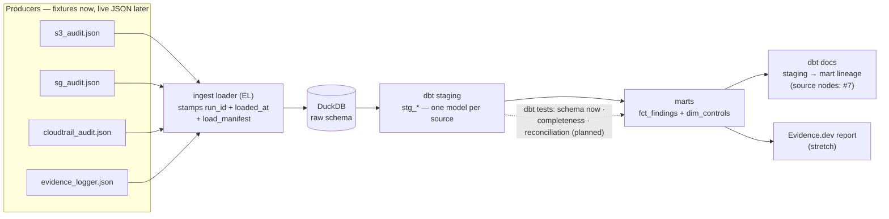

# Evidence Warehouse

The missing layer *after* the audit scripts run. Three AWS-API collectors ([`s3-audit`](https://github.com/0xBahalaNa/s3-audit), [`sg-audit`](https://github.com/0xBahalaNa/sg-audit), [`cloudtrail-audit`](https://github.com/0xBahalaNa/cloudtrail-audit)) plus one local policy-file checker ([`evidence-logger`](https://github.com/0xBahalaNa/evidence-logger)) each emit findings — and those findings evaporate at the terminal. This warehouse treats audit evidence as a data product: producer outputs land as raw records in DuckDB, dbt stages and unifies them into a queryable findings model, schema tests pin the contract at the data layer, and dbt docs publish the lineage from staging to mart (dbt `source()` nodes / source→mart lineage are planned — #7). Completeness and reconciliation tests that prove every expected collector reported — and that landing was lossless — are the next milestone; the loader already writes the `raw.load_manifest` signal those tests will key on.

The claim this repo exists to back up: **collecting evidence is not enough — you have to be able to prove the evidence set is complete, and show the lineage.**

> **Status:** v1.0 in development (August 2026). Contract-first build — the warehouse publishes a findings schema per source and builds against checked-in JSON fixtures; live producer wiring (`--json` output PRs) follows.

## Why This Exists

An evidence population with a silently missing source is the classic audit failure: the S3 collector erroring out doesn't make the account compliant, it makes the evidence *incomplete* — and absence of findings reads as absence of problems. Point-in-time scripts can't defend against that; a warehouse that fails the build when a collector is missing can. The same logic an IT auditor applies to a user-access-review population pull (is this the *whole* population? can you prove it?) is the target for this pipeline: completeness and accuracy enforced in the build, failing loudly instead of degrading silently.

The design is contract-first: none of the producers emits structured output today, so the warehouse owns the contract. Each source gets a documented findings schema, checked-in fixtures conform to it, and the entire dbt project builds and tests against those fixtures — the pattern warehouse teams use to develop against sources they don't control. Producers are then retrofitted to emit conforming JSON, one small PR each.

## Architecture Overview



The split is deliberately ELT: the Python loader does extract-and-load only — raw JSON files land in DuckDB `raw.*` tables with every row stamped with `run_id` and `loaded_at`, plus a `raw.load_manifest` row per landing file (including empty arrays at `row_count = 0`), and nothing else. All transformation lives in dbt, where it is versioned, tested, and documented. Staging models normalize each source to one row per finding with consistent types and status values; the `fct_findings` mart unifies all sources into a single queryable evidence table, joined to `dim_controls` — a seed mapping every check to its NIST 800-53 / FedRAMP High / CJIS v6.0 controls.

**Single-run snapshot:** each load rebuilds `raw.*`. `run_id` is a provenance stamp for the current collection, not retained history across loads. Multi-run retention is a deferred design change.

## Compliance Controls Addressed

These are the warehouse's own controls. The producers' controls (SC-28, SC-7, AU-2/AC-6(9), AC-3/AC-6) travel with their findings through the `dim_controls` mapping.

| NIST 800-53 Rev 5 | FedRAMP High | CJIS v6.0 | How This Repo Validates |
|---|:---:|:---:|---|
| AU-6 | Yes | Weekly-review + 1-year-retention delta | The analysis layer over collector output — findings queryable by control family, status, and the current run's provenance stamp |
| CA-7 | Yes | — | Per-run completeness enforcement (planned): every expected collector must report in the load — not continuous monitoring or trending over time (the warehouse retains one run) |
| AU-9 / AU-12(3) | Yes | — | Evidence integrity — `run_id` stamping ties every row to its collection; raw↔staged reconciliation (planned) will make a row-count change between landed and staged evidence a build failure |

Commercial crosswalk: completeness and reconciliation are SOX ITGC vocabulary — completeness & accuracy (C&A) over evidence populations — applied here per run, not as a multi-period monitoring time series.

## The Tests Are the Control

The dbt tests aren't code hygiene — they are the control implementation:

- **Completeness (planned)** — every expected collector from a seed will be checked against `raw.load_manifest` for the current run. A collector that never reports fails the build. Today the manifest **records** a zero-finding load (`row_count = 0`) and distinguishes it from an absent file; making `dbt build` green on that path needs staging to tolerate a missing `raw.<source>` table and ships with that milestone — do not read the manifest row as "the build already stays green."
- **Reconciliation (planned)** — `manifest.row_count` compared to staged row counts per source for the current run; a divergence fails the build — a chain-of-custody break caught in the pipeline instead of during an auditor's re-performance.
- **Schema tests** — `not_null`, `accepted_values`, and per-source uniqueness at staging (where a natural key holds). Status must be `PASS` / `WARN` / `FAIL`; duplicate natural keys fail the build. These pin the contract at the data layer, not just in a docs file. (`resource_id` is nullable on the mart: Sid-less policy statements normalize to NULL.)

## How an Auditor Uses This Output

When an assessor asks for the population of security checks in the current load, `fct_findings` answers it directly: filter by the run's `run_id`, group by control family or status. Once the completeness test ships, a green build will prove every expected collector reported in that run — the question auditors otherwise resolve through sampling and re-performance. That proof is scoped honestly: it does not cover what each collector can see (known producer blind spots are documented per source in `contracts/`). Zero-finding sources are represented in `raw.load_manifest` with `row_count = 0` so "ran and found nothing" is distinguishable from "never ran." Planned reconciliation will compare manifest counts to staged counts for the same run. `dbt docs` renders lineage from staging to mart so the path from landed record to finding is inspectable rather than asserted.

This slots into the broader evidence loop as the transform-retain-review layers: producers detect, the warehouse lands raw records stamped with `run_id` and `loaded_at`, transforms them under test, and serves the review surface (AU-6) that turns collector output into audit-record analysis.

## FedRAMP 20x Alignment

- **Compliance-as-code:** schema tests gate the build today; completeness and reconciliation controls are planned as dbt tests that will gate the build the same way — control failure is pipeline failure
- **Machine-readable evidence:** a published contract per source (`contracts/`, versioned markdown) with conforming JSON fixtures; findings land in a queryable mart instead of terminal output. Machine-enforceable JSON Schema in CI is v1.1 — dbt schema tests pin the contract at the data layer today
- **Per-run completeness (CA-7):** each load is a snapshot with a provenance `run_id`; completeness will enforce that every expected collector reported in that run — not a multi-run continuous-monitoring time series
- **API-driven evidence:** DuckDB + dbt expose the findings model to any downstream consumer — reporting, OSCAL transformation, or dashboarding

## Sample Evidence Output

A `fct_findings` excerpt (v1.0 target shape, built from checked-in fixtures):

| source | check_id | resource_id | status | control_ids | run_id | collected_at |
|---|---|---|---|---|---|---|
| s3_audit | s3-bucket-encryption-enabled | backups-unencrypted | FAIL | SC-28 | 20260715T130000Z | 2026-07-15T12:00:00Z |
| sg_audit | open-to-internet-risky-port | sg-0abc123def456789a | FAIL | SC-7 | 20260715T130000Z | 2026-07-15T12:00:00Z |
| cloudtrail_audit | root-account-usage | ACCOUNT | FAIL | AU-2, AC-6(9) | 20260715T130000Z | 2026-07-14T21:00:00Z |
| evidence_logger | wildcard-action | DangerousAdmin | FAIL | AC-6 | 20260715T130000Z | 2026-07-14T21:00:00Z |

`status` above is the **normalized** mart value (`CRITICAL`→`FAIL` for root usage).
`control_ids` is the `dim_controls` join output — not carried in raw fixtures — and the
join is **one-to-many**: a single check can evidence several controls (root usage above).
`collected_at` is the producer's collection time (per the checked-in fixtures); `run_id`
stamps the load, so it always postdates the evidence it carries.

Planned control behavior (v1.0 target — completeness test not shipped yet): if `sg_audit` is absent from the landing directory on a load, the completeness test fails the build rather than letting the population go quietly short:

```
FAIL 1 completeness_expected_sources
  Source 'sg_audit' is in the expected-sources manifest but absent
  from run_id 20260716T090000Z — evidence population incomplete.
```

## Requirements

- Python 3.11+
- [dbt-core](https://docs.getdbt.com/) with the [dbt-duckdb](https://github.com/duckdb/dbt-duckdb) adapter (bundles DuckDB)

## Usage

```bash
mkdir -p raw && cp fixtures/*.json raw/    # landing dir (fixtures stay immutable)
python ingest/load_raw.py --raw-dir raw/   # EL: land JSON into DuckDB raw schema (run_id + loaded_at + load_manifest)
dbt build                                  # models + tests — the control layer gates here
dbt docs generate && dbt docs serve        # browse staging → mart lineage (source nodes: #7)
```

## Repository Structure

```
evidence-warehouse/
├── contracts/            # findings schema per source — the published contract
├── fixtures/             # checked-in JSON conforming to contracts (permanent test data)
├── ingest/               # thin Python EL loader
├── models/
│   ├── staging/          # stg_s3_audit, stg_sg_audit, stg_cloudtrail_audit, stg_evidence_logger
│   └── marts/            # fct_findings, dim_controls
├── seeds/                # dim_controls mapping (expected-sources seed ships with completeness)
├── tests/                # singular uniqueness tests (completeness + reconciliation planned)
└── README.md
```

## Future Enhancements

- Completeness + reconciliation dbt tests keyed on `raw.load_manifest` (next milestone)
- `--json` output PRs on the four producers, conforming to the published contracts (`cloudtrail-audit` first — its finding dicts already exist in memory; must carry `eventID` for uniqueness)
- Live end-to-end run: producers → landing directory → warehouse, no fixtures
- Evidence.dev thin reporting page over `fct_findings` (findings by control family, by status)
- Multi-run retention (append or partition raw by `run_id`) — separate design change
- `iam-access-review` as a fifth source (August 2026) — a UAR-shaped source (identities and entitlements), exercising the contract design beyond resource findings

## What This Project Demonstrates

Audit evidence treated as a data product, with the data-engineering discipline that implies: contract-first development against sources the warehouse doesn't control, an explicit ELT split, staging/mart layering, and data tests used not as hygiene but as the control implementation — SOX-style completeness & accuracy reasoning applied per run. It's the difference between "I wrote scripts that check things" and "I can hand an assessor a defensible evidence population with provable lineage."

## References

- [dbt documentation](https://docs.getdbt.com/)
- [DuckDB documentation](https://duckdb.org/docs/)
- [NIST SP 800-53 Rev 5](https://csrc.nist.gov/pubs/sp/800/53/r5/upd1/final)
- [FBI CJIS Security Policy](https://le.fbi.gov/informational-tools/cjis)
- Producer repos: [s3-audit](https://github.com/0xBahalaNa/s3-audit) · [sg-audit](https://github.com/0xBahalaNa/sg-audit) · [cloudtrail-audit](https://github.com/0xBahalaNa/cloudtrail-audit) · [evidence-logger](https://github.com/0xBahalaNa/evidence-logger)

## License

MIT. Full text in [LICENSE](LICENSE).
